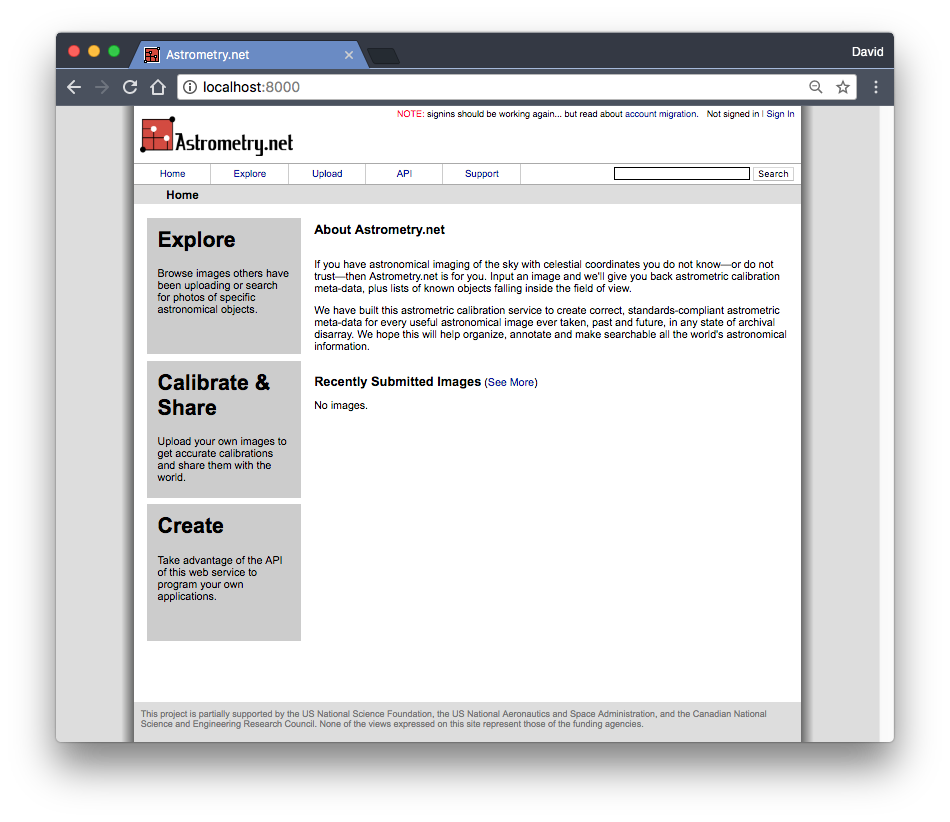

Out-of-the-box Astrometry.net for local plate solving using Docker.

## Overview

I wanted to be able to spin up a local plate solver (including web API) and with (almost) zero configuration.  In my case, I use [astrometry.net](http://astrometry.net) (ADN) to assist building mount models for my telescope, so I want to be able to stand up a new ADN server on a laptop, or perhaps a raspberry pi to give me ADN's capability without access to the interwebs.  This is similar to [ansvr](https://adgsoftware.com/ansvr/) on Windows, but will work on any operating system that can run Docker.

My solution is a Docker image ([dm90/astrometry](https://hub.docker.com/r/dm90/astrometry/)) which:

* Has astrometry.net compiled and ready for use at the command line
* Has astrometry.net python libraries compiled added to the Python path
* Has a preconfigured NOVA server (basic settings) that launches witha single command

## Quickstart

If you are familiar with Docker, usage is pretty straightforward both for starting the NOVA server or for using command-line utilities within the astrometry container.

### Download

Assuming you have Docker installed on your system, run:

`docker pull dm90/astrometry`

This could take a bit to download (I haven't attempted to shrink the image yet)

### Running the NOVA Server

#### Using docker run

Can be launched with a single command.  For example:

`docker run --name nova --restart unless-stopped -v /my/index/data:/usr/local/astrometry/data -p 8000:8000 dm90/astrometry`

The command above starts a docker container using the `dm90/astrometry` image and:

* `--name nova` gives the container the name "nova"

* `--restart unless-stopped` restarts the container after errors/reboots

* `-v /my/index/data:/usr/local/astrometry/data` mounts your index files into the astrometry.net data directory

* `-p 8000:8000` exposes the container's web application on port 8000 on the host machine

#### Using docker-compose

The better way is to use docker-compose (see [docker-compose.yml](./docker-compose.yml).  This involves just:

`docker-compose up -d`

### Test

Once the Docker container is running go to http://localhost:8000 (or replace "localhost" with your hostname or IP) and you should get the nova homepage:

## Index files

The docker images comes with only one index file for testing, so you'll probably want to add your own. See the [index](./index) folder in this repo for a description of how to do this.

------------------------
*README is in progress!*
